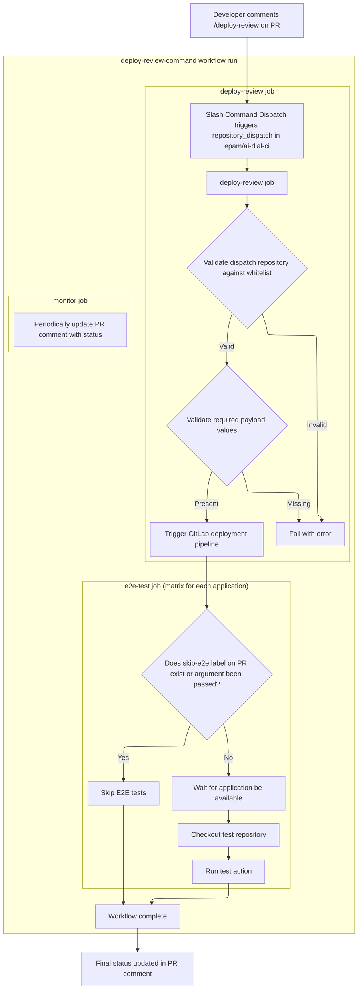

# AI DIAL workflows

- [AI DIAL workflows](#ai-dial-workflows)
  - [Overview](#overview)
  - [Usage](#usage)
    - [NodeJS (npm)](#nodejs-npm)
      - [PR Workflow](#pr-workflow)
      - [Release Workflow](#release-workflow)
    - [Java (gradle)](#java-gradle)
      - [PR Workflow (Docker)](#pr-workflow-docker)
      - [Release Workflow (Docker)](#release-workflow-docker)
      - [Dependency Review](#dependency-review)
    - [Python (Poetry)](#python-poetry)
      - [PR Workflow (Docker)](#pr-workflow-docker-1)
      - [Release Workflow (Docker)](#release-workflow-docker-1)
      - [PR Workflow (package)](#pr-workflow-package)
      - [Release Workflow (package)](#release-workflow-package)
    - [Generic Docker](#generic-docker)
      - [PR Workflow](#pr-workflow-1)
      - [Release Workflow](#release-workflow-1)
    - [Others](#others)
      - [Validate PR title](#validate-pr-title)
      - [Deploy review environment](#deploy-review-environment)
        - [End-to-end tests](#end-to-end-tests)
          - [Test Repository Structure](#test-repository-structure)
          - [Skipping E2E Tests](#skipping-e2e-tests)
      - [Cleanup for untagged images in GHCR](#cleanup-for-untagged-images-in-ghcr)
      - [Trigger deployment of development environment in GitLab](#trigger-deployment-of-development-environment-in-gitlab)
      - [Trivy additional configuration](#trivy-additional-configuration)
      - [Dependabot](#dependabot)
        - [Dependabot Pull Requests Automation](#dependabot-pull-requests-automation)
  - [Contributing](#contributing)

## Overview

Continuous Integration instrumentation for [AI DIAL](https://dialx.ai) components.

Contains reusable workflows for AI-DIAL group of repositories under EPAM GitHub organization.

## Usage

These workflows could be imported to any repository under EPAM GitHub organization as standard `.github/workflows` files. See examples below (replace `@main` with specific version tag).

### NodeJS (npm)

> [!tip]
> Workflows allow independent choices of output artifacts: container image, npm package, or both (default) via `docker-build-enabled` and `publish-enabled` inputs respectively. Set variable values to match your needs.

#### PR Workflow

`pr.yml`

```yml
name: PR Workflow

on:
  pull_request:
    branches: [development, release-*]

concurrency:
  group: ${{ github.workflow }}-${{ github.event.pull_request.number }}
  cancel-in-progress: true

jobs:
  run_tests:
    uses: epam/ai-dial-ci/.github/workflows/node_pr.yml@main
    secrets: inherit
```

#### Release Workflow

`release.yml`

```yml
name: Release Workflow

on:
  push:
    branches: [development, release-*]

concurrency:
  group: ${{ github.workflow }}-${{ github.ref }}
  cancel-in-progress: true

jobs:
  release:
    uses: epam/ai-dial-ci/.github/workflows/node_release.yml@main
    secrets: inherit
```

### Java (gradle)

#### PR Workflow (Docker)

`pr.yml`

```yml
name: PR Workflow

on:
  pull_request:
    branches: [development, release-*]

concurrency:
  group: ${{ github.workflow }}-${{ github.event.pull_request.number }}
  cancel-in-progress: true

jobs:
  run_tests:
    uses: epam/ai-dial-ci/.github/workflows/java_pr.yml@main
    secrets: inherit
```

#### Release Workflow (Docker)

`release.yml`

```yml
name: Release Workflow

on:
  push:
    branches: [development, release-*]

concurrency:
  group: ${{ github.workflow }}-${{ github.ref }}
  cancel-in-progress: true

jobs:
  release:
    uses: epam/ai-dial-ci/.github/workflows/java_release.yml@main
    secrets: inherit
```

#### Dependency Review

To support Dependabot security updates, GitHub requires uploading dependency graph data to GitHub's Dependency Graph API. To enable this feature, add the workflow from example below to your repository. You'll start getting review comments on PRs.

`dependency-review.yml`

```yml
name: Dependency Review

on:
  pull_request_target:
    types:
      - opened
      - synchronize

concurrency:
  group: ${{ github.workflow }}-${{ github.event.pull_request.number }}
  cancel-in-progress: true

jobs:
  dependency-review:
    uses: epam/ai-dial-ci/.github/workflows/java_dependency_review.yml@main
    secrets:
      ACTIONS_BOT_TOKEN: ${{ secrets.ACTIONS_BOT_TOKEN }}
```

### Python (Poetry)

#### PR Workflow (Docker)

`pr.yml`

```yml
name: PR Workflow

on:
  pull_request:
    branches: [development, release-*]

concurrency:
  group: ${{ github.workflow }}-${{ github.event.pull_request.number }}
  cancel-in-progress: true

jobs:
  run_tests:
    uses: epam/ai-dial-ci/.github/workflows/python_docker_pr.yml@main
    secrets: inherit
```

#### Release Workflow (Docker)

`release.yml`

```yml
name: Release Workflow

on:
  push:
    branches: [development, release-*]

concurrency:
  group: ${{ github.workflow }}-${{ github.ref }}
  cancel-in-progress: true

jobs:
  release:
    uses: epam/ai-dial-ci/.github/workflows/python_docker_release.yml@main
    secrets: inherit
```

#### PR Workflow (package)

`pr.yml`

```yml
name: PR Workflow

on:
  pull_request:
    branches: [development, release-*]

concurrency:
  group: ${{ github.workflow }}-${{ github.event.pull_request.number }}
  cancel-in-progress: true

jobs:
  run_tests:
    uses: epam/ai-dial-ci/.github/workflows/python_package_pr.yml@main
    secrets: inherit
```

#### Release Workflow (package)

`release.yml`

```yml
name: Release Workflow

on:
  push:
    branches: [development, release-*]

concurrency:
  group: ${{ github.workflow }}-${{ github.ref }}
  cancel-in-progress: true

jobs:
  release:
    uses: epam/ai-dial-ci/.github/workflows/python_package_release.yml@main
    secrets: inherit
```

### Generic Docker

#### PR Workflow

`pr.yml`

```yml
name: PR Workflow

on:
  pull_request:
    branches: [development, release-*]

concurrency:
  group: ${{ github.workflow }}-${{ github.event.pull_request.number }}
  cancel-in-progress: true

jobs:
  run_tests:
    uses: epam/ai-dial-ci/.github/workflows/generic_docker_pr.yml@main
    secrets: inherit
```

#### Release Workflow

`release.yml`

```yml
name: Release Workflow

on:
  push:
    branches: [development, release-*]

concurrency:
  group: ${{ github.workflow }}-${{ github.ref }}
  cancel-in-progress: true

jobs:
  release:
    uses: epam/ai-dial-ci/.github/workflows/generic_docker_release.yml@main
    secrets: inherit
```

### Others

#### Validate PR title

`pr-title-check.yml`

```yml
name: "Validate PR title"

on:
  pull_request_target:
    types:
      - opened
      - edited
      - reopened

concurrency:
  group: ${{ github.workflow }}-${{ github.event.pull_request.number }}
  cancel-in-progress: true

jobs:
  pr-title-check:
    uses: epam/ai-dial-ci/.github/workflows/pr-title-check.yml@main
    secrets:
      ACTIONS_BOT_TOKEN: ${{ secrets.ACTIONS_BOT_TOKEN }}
```

#### Deploy review environment

`slash-command-dispatch.yml`

```yml
name: Slash Command Dispatch
on:
  issue_comment:
    types: [created]
jobs:
  slashCommandDispatch:
    runs-on: ubuntu-latest
    if: ${{ github.event.issue.pull_request }}
    steps:
      - name: Slash Command Dispatch
        id: scd
        uses: peter-evans/slash-command-dispatch@13bc09769d122a64f75aa5037256f6f2d78be8c4 # v4.0.0
        with:
          token: ${{ secrets.ACTIONS_BOT_TOKEN }}
          reaction-token: ${{ secrets.ACTIONS_BOT_TOKEN }}
          config: >
            [
              {
                "command": "deploy-review",
                "permission": "write",
                "issue_type": "pull-request",
                "repository": "epam/ai-dial-ci",
                "static_args": [
                  "application=${{ github.event.repository.name }}"
                ]
              }
            ]
```

##### End-to-end tests

The E2E testing system for review environments enables automated testing of pull request changes in isolated, short-lived environments. When a developer comments `/deploy-review` on a PR, the system deploys the PR code to a review environment and runs E2E tests against it.



###### Test Repository Structure

A test repository must provide [composite actions](https://docs.github.com/en/actions/tutorials/create-actions/create-a-composite-action) with the following layout:

```text
.github/
  actions/
    test-<application>/
      action.yml <-- Composite action that runs tests
```

> [!note]
> The `<application>` placeholder must match the `application` value passed in `static_args` of the `slash-command-dispatch` action

The action must have inputs:

- `environment-url`: URL of the deployed review environment
- `report-prefix`: (Optional) Prefix for report files generated by the action
- `test-branch`: (Optional) Branch of repository with tests source code to use

Besides inputs, the action will have access to environment variables:

- `E2E_ADMIN`
- `E2E_OVERLAY_USERNAME`
- `E2E_PASSWORD`
- `E2E_USERNAME`
- `NEXT_PUBLIC_OVERLAY_USER_BUCKET`

> [!note]
> One composite action should test one application only

###### Skipping E2E Tests

If you need to disable E2E tests execution:

- for the **whole repository**: add `skip-e2e` argument to `static_args` list

  ```yml
                "static_args": [
                  "application=${{ github.event.repository.name }}",
                  "skip-e2e"
                ]
  ```

- for the **specific PR**: assign `skip-e2e` label to PR
- **once**: use `/deploy-review skip-e2e` command in PR comment

#### Cleanup for untagged images in GHCR

`cleanup-untagged-images.yml`

```yml
name: Cleanup untagged images

on:
  schedule:
    - cron: "0 0 * * *"

jobs:
  clean:
    name: Delete untagged images
    runs-on: ubuntu-latest
    permissions:
      packages: write
    steps:
      - uses: dataaxiom/ghcr-cleanup-action@cd0cdb900b5dbf3a6f2cc869f0dbb0b8211f50c4 # v1.0.16
        with:
          delete-untagged: true
```

#### Trigger deployment of development environment in GitLab

A common case is to trigger development environment(s) update from GitHub to GitLab, e.g. each time a `development` branch produces a new artifact. Also, it could be not single, but several environments, representing different configuration presets of a single app. To use the example below:

1. add a new [repository secret](https://docs.github.com/en/actions/security-guides/encrypted-secrets) with name `DEPLOY_HOST` and value of the gitlab host, e.g. `gitlab.example.com`
1. create a new [environment](https://docs.github.com/en/actions/managing-workflow-runs-and-deployments/managing-deployments/managing-environments-for-deployment#creating-an-environment), e.g. `development`
1. for the environment, add [environment secrets](https://docs.github.com/en/actions/managing-workflow-runs-and-deployments/managing-deployments/managing-environments-for-deployment#environment-secrets) with names `DEPLOY_ACCESS_TOKEN` and `DEPLOY_TRIGGER_TOKEN` and values of the gitlab access token and trigger token respectively.
1. use the example workflow file below

`deploy-development.yml`

```yml
name: Deploy development

on:
  workflow_dispatch: # manual run
  registry_package: # on new package version (main path)
  workflow_run: # HACK: redundant trigger to mitigate GitHub's huge delays in registry_package event processing
    workflows: ["Release Workflow"]
    types:
      - completed

jobs:
  gitlab-dev-deploy:
    if: |
      github.event_name == 'workflow_dispatch' ||
      github.event.registry_package.package_version.container_metadata.tag.name == 'development' ||
      (github.event.workflow_run.conclusion == 'success' && github.event.workflow_run.head_branch == 'development')
    uses: epam/ai-dial-ci/.github/workflows/deploy-development.yml@main
    with:
      gitlab-project-id: "1487"
    secrets:
      DEPLOY_HOST: ${{ secrets.DEPLOY_HOST }}
      DEPLOY_ACCESS_TOKEN: ${{ secrets.DEPLOY_ACCESS_TOKEN }}
      DEPLOY_TRIGGER_TOKEN: ${{ secrets.DEPLOY_TRIGGER_TOKEN }}
```

In case of multiple environments, continue creating multiple GitHub environments named after e.g. feature sets, each with its own secrets, then use matrix approach as shown below.

`deploy-development.yml`

```yml
name: Deploy development

on:
  workflow_dispatch: # manual run
  registry_package: # on new package version (main path)
  workflow_run: # HACK: redundant trigger to mitigate GitHub's huge delays in registry_package event processing
    workflows: ["Release Workflow"]
    types:
      - completed

jobs:
  trigger:
    if: |
      github.event_name == 'workflow_dispatch' ||
      github.event.registry_package.package_version.container_metadata.tag.name == 'development' ||
      (github.event.workflow_run.conclusion == 'success' && github.event.workflow_run.head_branch == 'development')
    strategy:
      fail-fast: false
      matrix:
        include:
          - environment-name: "development"
            gitlab-project-id: "1487"
          - environment-name: "feature-1"
            gitlab-project-id: "1489"
          - environment-name: "feature-2"
            gitlab-project-id: "1984"
          - environment-name: "feature-3"
            gitlab-project-id: "1337"

    name: Deploy to ${{ matrix.environment-name }}
    uses: epam/ai-dial-ci/.github/workflows/deploy-development.yml@main
    with:
      gitlab-project-id: ${{ matrix.gitlab-project-id }}
      environment-name: ${{ matrix.environment-name }}
    secrets:
      DEPLOY_HOST: ${{ secrets.DEPLOY_HOST }}
      DEPLOY_ACCESS_TOKEN: ${{ secrets.DEPLOY_ACCESS_TOKEN }}
      DEPLOY_TRIGGER_TOKEN: ${{ secrets.DEPLOY_TRIGGER_TOKEN }}
```

#### Trivy additional configuration

To change predefined Trivy parameters or set up additional configuration options, create `trivy.yaml` file in root of your repository. Use example below to add fallback repositories for vulnerabilities and checks DB and thus mitigate rate limit issues.

`trivy.yaml`

```yaml
# Trivy configuration file
# https://aquasecurity.github.io/trivy/latest/docs/references/configuration/config-file/
db:
  no-progress: true
  repository:
    - mirror.gcr.io/aquasec/trivy-db:2
    - public.ecr.aws/aquasecurity/trivy-db:2
    - ghcr.io/aquasecurity/trivy-db:2
  java-repository:
    - mirror.gcr.io/aquasec/trivy-java-db:1
    - public.ecr.aws/aquasecurity/trivy-java-db:1
    - ghcr.io/aquasecurity/trivy-java-db:1
misconfiguration:
  checks-bundle-repository: mirror.gcr.io/aquasec/trivy-checks:1
```

#### Dependabot

It's strongly recommended to enable at least [Dependabot security updates](https://docs.github.com/en/code-security/dependabot/dependabot-security-updates/about-dependabot-security-updates) for your repositories to stay protected from known vulnerabilities in dependencies. To do that, create `.github/dependabot.yml` file in your repository.

> [!note]
> The example for `java` with `gradle` as a package manager given. Adjust repo's **primary** [package-ecosystem](https://docs.github.com/en/code-security/dependabot/dependabot-version-updates/configuration-options-for-the-dependabot.yml-file#package-ecosystem) accordingly. Keep `github-actions` ecosystem as is

`dependabot.yml`

```yml
version: 2
updates:
  - package-ecosystem: "gradle"
    directory: "/"
    schedule:
      interval: "weekly"
      day: "wednesday"
      time: "09:00"
    # Disable version updates, keep security updates only
    open-pull-requests-limit: 0
    commit-message:
      # Prefix all commit messages with "chore: "
      prefix: "chore"
  - package-ecosystem: "github-actions"
    directory: "/"
    schedule:
      interval: "weekly"
      day: "wednesday"
      time: "09:00"
    commit-message:
      # Prefix all commit messages with "chore: "
      prefix: "chore"
    groups:
      ai-dial-ci:
        applies-to: version-updates
        patterns:
          - "epam/ai-dial-ci/*"
      github-actions:
        applies-to: version-updates
        patterns:
          - "*"
        exclude-patterns:
          - "epam/ai-dial-ci/*"
    open-pull-requests-limit: 10
```

##### Dependabot Pull Requests Automation

Repository maintainers may want to automate approval/merging of Dependabot PRs to reduce manual effort. The example below will automatically approve all Dependabot PRs, and merge those that belong to `ai-dial-ci` group and are **not major** version updates.

> [!tip]
> Remove `steps.metadata.outputs.dependency-group == 'ai-dial-ci'` condition to enable auto-merging for all Dependabot PRs except major version updates

`dependabot-automation.yml`

```yml
name: Dependabot Automation

on: pull_request_target

permissions: {}

jobs:
  dependabot:
    runs-on: ubuntu-latest
    if: |
      github.event.pull_request.user.login == 'dependabot[bot]' &&
      github.repository_owner == 'epam'
    steps:
      - name: Dependabot metadata
        id: metadata
        uses: dependabot/fetch-metadata@08eff52bf64351f401fb50d4972fa95b9f2c2d1b # v2.4.0
      - name: Approve PR
        run: gh pr review --approve "$PR_URL"
        env:
          PR_URL: ${{ github.event.pull_request.html_url }}
          GH_TOKEN: ${{ secrets.ACTIONS_BOT_TOKEN }}
      - name: Merge PR
        if: |
          steps.metadata.outputs.dependency-group == 'ai-dial-ci' &&
          steps.metadata.outputs.update-type != 'version-update:semver-major'
        run: gh pr merge --auto --squash "$PR_URL"
        env:
          PR_URL: ${{ github.event.pull_request.html_url }}
          GH_TOKEN: ${{ secrets.ACTIONS_BOT_TOKEN }}
```

## Contributing

This project contains reusable workflows under [`.github/workflows`](.github/workflows) directory, and composite actions under [`actions`](actions) directory.

Check [contribution guidelines](CONTRIBUTING.md) for details.
