# Branching Strategy

1. A `development` is the branch for all new work
1. All code changes are merged from feature branches to `development` via pull requests
1. When there's enough changes in `development` for a new release, maintainer cuts `release-X.Y` branch. Release enters stabilization phase, the branch produce numbered RC artifacts (`X.Y.0-rc.N`)
1. Once the maintainer decides the release is stable, he manually (`workflow_dispatch`) triggers `Release Workflow` for `release-X.Y` branch with `promote` option set. Stable `X.Y.0` is published
1. Since that moment, `release-X.Y` enters maintenance phase, and any subsequent pushes to that branch produce patches (`X.Y.1`, `X.Y.2`, ...)
1. Fixes to maintenance branches must be backported from `development` branch via cherry-picks

## Version Scheme

| Event                                        | Version format           | Example        | Python (no hyphens) |
| -------------------------------------------- | ------------------------ | -------------- | ------------------- |
| Push to `development`                        | `{next-minor}.0-dev.<n>` | `1.1.0-dev.42` | `1.1.0.dev42`       |
| Push to `release-X.Y`, no stable yet         | `X.Y.0-rc.<n>`           | `1.0.0-rc.2`   | `1.0.0rc2`          |
| `promote=true` on `release-X.Y`              | `X.Y.0`                  | `1.0.0`        | `1.0.0`             |
| Push to `release-X.Y`, stable `X.Y.0` exists | `X.Y.<n+1>` (patch)      | `1.0.2`        | `1.0.2`             |

> [!note]
> The RC phase applies **only** to `X.Y.0`

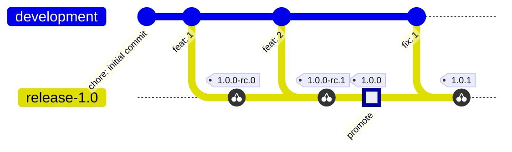

## Example Repository Lifecycle

Each scenario is defined by its pre-conditions and the complete set of observable outputs. Verification commands assume `PKG` = npm package name, `IMAGE` = `ghcr.io/org/repo`.

### Scenario 0 - First push to `development` (repo is empty)

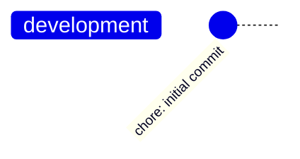

| Output                         | Expected value             |
| ------------------------------ | -------------------------- |
| Next version                   | `0.1.0-dev.1`              |
| Git tag                        | -                          |
| Container tags                 | `IMAGE:development`        |
| npm artifacts (`tag: version`) | `development: 0.1.0-dev.1` |
| GitHub Release                 | -                          |
| Release changelog              | -                          |

**Verify:**

```bash
git tag --sort=-version:refname
# --> (empty - no tags created)

docker manifest inspect $IMAGE:development
# --> succeeds (manifest exists)

npm dist-tag ls $PKG
# --> development: 0.1.0-dev.1

gh release list
# --> (empty - no releases created)
```

### Scenario 1 - Second push to `development`

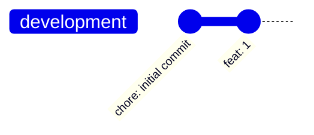

| Output                         | Expected value             |
| ------------------------------ | -------------------------- |
| Next version                   | `0.1.0-dev.2`              |
| Git tag                        | -                          |
| Container tags                 | `IMAGE:development`        |
| npm artifacts (`tag: version`) | `development: 0.1.0-dev.2` |
| GitHub Release                 | -                          |
| Release changelog              | -                          |

**Verify:**

```bash
git tag --sort=-version:refname
# --> (empty - no tags created)

docker manifest inspect $IMAGE:development
# --> succeeds (manifest exists and digest is updated)

npm dist-tag ls $PKG
# --> development: 0.1.0-dev.2

gh release list
# --> (empty - no releases created)
```

### Scenario 2 - `release-1.0` creation (no tags or other release branches exist)

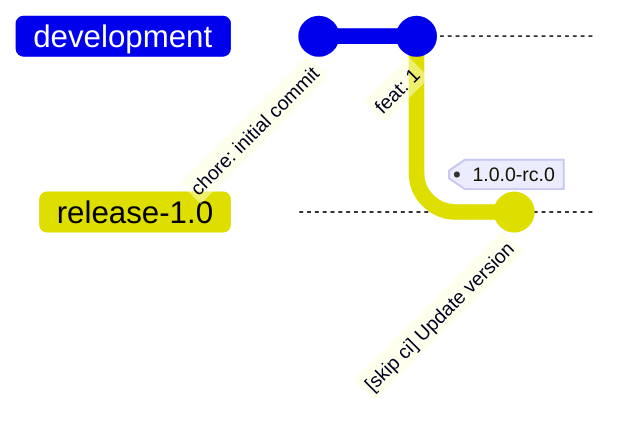

| Output                         | Expected value                                     |
| ------------------------------ | -------------------------------------------------- |
| Next version                   | `1.0.0-rc.0`                                       |
| Git tag                        | `1.0.0-rc.0`                                       |
| container tags                 | `IMAGE:1.0.0-rc.0` created                         |
| npm artifacts (`tag: version`) | `1.0-rc: 1.0.0-rc.0` created                       |
| GitHub Release                 | `1.0.0-rc.0` - `isPrerelease=true`, `latest=false` |
| Release changelog              | All commits in the repo (no baseline tag exists)   |

**Verify:**

```bash
git tag --sort=-version:refname
# --> 1.0.0-rc.0

docker manifest inspect $IMAGE:1.0.0-rc.0
# --> succeeds (manifest exists)

docker manifest inspect $IMAGE:latest
# --> fails OR digest is unchanged from before this push

npm dist-tag ls $PKG
# --> 1.0-rc: 1.0.0-rc.0
#     development: 0.1.0-dev.2

gh release view 1.0.0-rc.0 --json isPrerelease
# --> {"isPrerelease":true}

gh release view 1.0.0-rc.0 --json body | jq -r '.body'
# --> chore: initial commit
#     feat: 1
```

### Scenario 3 - push to `development` when `release-1.0` exists with RC tags (no stable yet)

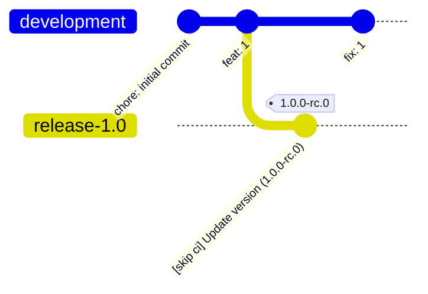

| Output                         | Expected value                     |
| ------------------------------ | ---------------------------------- |
| Next version                   | `1.0.0-dev.1`                      |
| Git tag                        | -                                  |
| Container tags                 | `IMAGE:development`                |
| npm artifacts (`tag: version`) | `development: 1.0.0-dev.1` created |
| GitHub Release                 | -                                  |
| Release changelog              | -                                  |

**Verify:**

```bash
git tag --sort=-version:refname
# --> 1.0.0-rc.0   (no new tags created)

docker manifest inspect $IMAGE:development
# --> succeeds (manifest exists and digest is updated)

npm dist-tag ls $PKG
# --> 1.0-rc: 1.0.0-rc.0
#     development: 1.0.0-dev.1

gh release list
# --> 1.0.0-rc.0  Pre-release  (1.0.0-rc.0)
```

### Scenario 4 - pick fix onto `release-1.0` while RC tags exist, but no stable yet

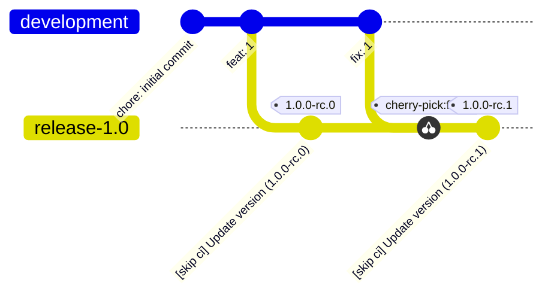

| Output                         | Expected value                                     |
| ------------------------------ | -------------------------------------------------- |
| Next version                   | `1.0.0-rc.1`                                       |
| Git tag                        | `1.0.0-rc.1`                                       |
| container tags                 | `IMAGE:1.0.0-rc.1` created                         |
| npm artifacts (`tag: version`) | `1.0-rc: 1.0.0-rc.1` created                       |
| GitHub Release                 | `1.0.0-rc.1` - `isPrerelease=true`, `latest=false` |
| Release changelog              | commits since `1.0.0-rc.0` ONLY                    |

**Verify:**

```bash
git tag --sort=-version:refname
# --> 1.0.0-rc.1
#     1.0.0-rc.0

docker manifest inspect $IMAGE:1.0.0-rc.1
# --> succeeds (manifest exists)

npm dist-tag ls $PKG
# --> 1.0-rc: 1.0.0-rc.1
#     development: 1.0.0-dev.1

gh release view 1.0.0-rc.1 --json isPrerelease
# --> {"isPrerelease":true}


gh release view 1.0.0-rc.1 --json body | jq -r '.body'
# --> fix: 1
```

### Scenario 5 - `workflow_dispatch promote=true` on `release-1.0`

**Pre-conditions:** `1.0.0-rc.1` is the latest tag; no stable `1.0.x` tag exists.

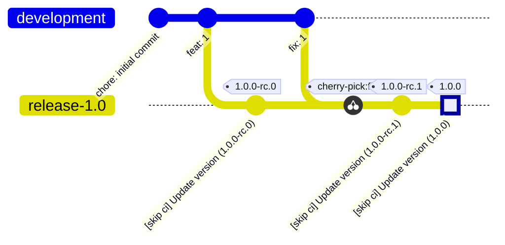

| Output                       | Expected value                                                                       |
| ---------------------------- | ------------------------------------------------------------------------------------ |
| Next version                 | `1.0.0`                                                                              |
| Git tag                      | `1.0.0`                                                                              |
| container tags               | `IMAGE:1.0.0` **AND** `IMAGE:latest`                                                 |
| npm artifacts (tag: version) | `latest: 1.0.0`                                                                      |
| GitHub Release               | `1.0.0` - `isPrerelease=false`, `latest`                                             |
| Release changelog            | All commits on `release-1.0` - not just since `1.0.0-rc.1`, but since branch was cut |

**Verify:**

```bash
git tag --sort=-version:refname
# --> 1.0.0
#     1.0.0-rc.1
#     1.0.0-rc.0

docker manifest inspect $IMAGE:1.0.0
# --> succeeds (manifest exists)

docker manifest inspect $IMAGE:latest
# --> digest EQUALS digest of $IMAGE:1.0.0

npm dist-tag ls $PKG
# --> 1.0-rc: 1.0.0-rc.1
#     development: 1.0.0-dev.1
#     latest: 1.0.0

gh release view 1.0.0 --json isPrerelease
# --> {"isPrerelease":false}

gh release view 1.0.0 --json body | jq -r '.body'
# --> chore: initial commit
#     feat: 1
#     fix: 1
```

### Scenario 6 - Sequential push of 2 commits to `development` after stable `1.0.0` exists

**Pre-conditions:** End state of Scenario 5. Tags: `1.0.0`, `1.0.0-rc.1`, `1.0.0-rc.0`.
npm: `latest: 1.0.0`, `1.0-rc: 1.0.0-rc.1`, `development: 1.0.0-dev.1`.
`IMAGE:latest` points to `IMAGE:1.0.0`. No `2.x` stable exists.

> [!note]
> If there's no time gap between the 2 commits, second workflow run will cancel the first one. This may result in missing `1.1.0-dev.2` tag.
> It not affect the final state of the scenario, though

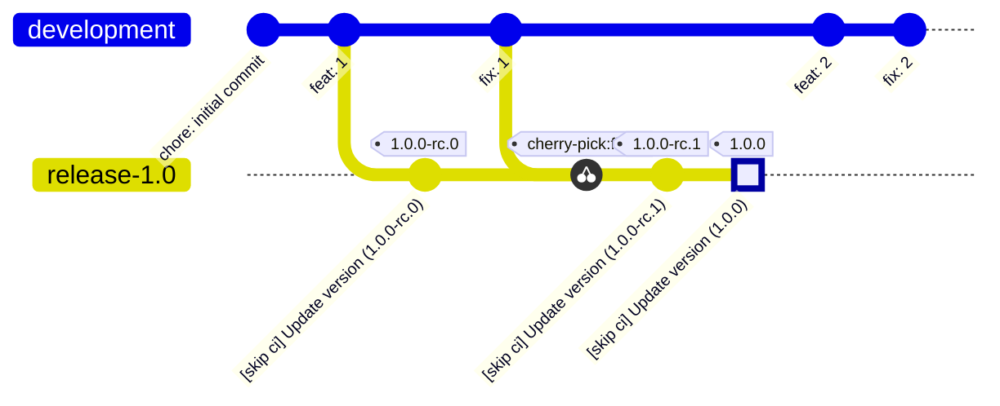

| Output                          | Expected value             |
| ------------------------------- | -------------------------- |
| Next version                    | `1.1.0-dev.3`              |
| Git tag                         | -                          |
| Container tags                  | `IMAGE:development`        |
| npm artifacts (tag --> version) | `development: 1.1.0-dev.3` |
| GitHub Release                  | -                          |
| Release changelog               | -                          |

**Verify:**

```bash
git tag --sort=-version:refname
# --> 1.0.0
#     1.0.0-rc.1
#     1.0.0-rc.0   (no new tags created)

docker manifest inspect $IMAGE:development
# --> succeeds (manifest exists and digest is updated)

npm dist-tag ls $PKG
# --> latest: 1.0.0
#     1.0-rc: 1.0.0-rc.1
#     development: 1.1.0-dev.3

gh release list
# --> 1.0.0       Latest       (1.0.0)
#     1.0.0-rc.1  Pre-release  (1.0.0-rc.1)
#     1.0.0-rc.0  Pre-release  (1.0.0-rc.0)
```

### Scenario 7 - Backport fix to `release-1.0` after stable `1.0.0` exists (first patch)

**Pre-conditions:** End state of Scenario 6. Tags: `1.0.0`, `1.0.0-rc.1`, `1.0.0-rc.0`.
npm: `latest: 1.0.0`, `1.0-rc: 1.0.0-rc.1`, `development: 1.1.0-dev.3`.
`development` has `feat: 2` and `fix: 2` - neither is cherry-picked to `release-1.0` yet.

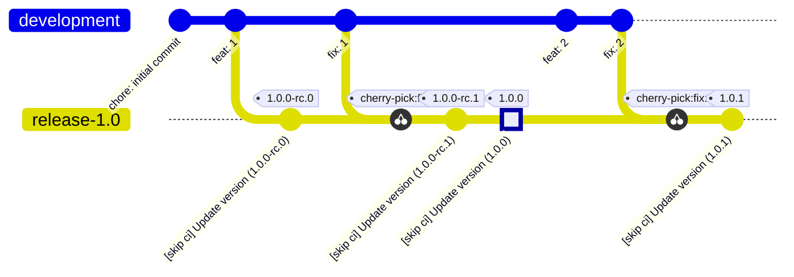

| Output                          | Expected value                           |
| ------------------------------- | ---------------------------------------- |
| Next version                    | `1.0.1`                                  |
| Git tag                         | `1.0.1`                                  |
| Container tags                  | `IMAGE:1.0.1` **AND** `IMAGE:latest`     |
| npm artifacts (tag --> version) | `latest: 1.0.1` updated                  |
| GitHub Release                  | `1.0.1` - `isPrerelease=false`, `latest` |
| Release changelog               | Commits since `1.0.0` tag only           |

**Verify:**

```bash
git tag --sort=-version:refname
# --> 1.0.1
#     1.0.0
#     1.0.0-rc.1
#     1.0.0-rc.0

docker manifest inspect $IMAGE:1.0.1
# --> succeeds (manifest exists)

docker manifest inspect $IMAGE:latest
# --> digest EQUALS digest of $IMAGE:1.0.1

npm dist-tag ls $PKG
# --> latest: 1.0.1
#     development: 1.1.0-dev.3
#     1.0-rc: 1.0.0-rc.1

gh release view 1.0.1 --json isPrerelease
# --> {"isPrerelease":false}

gh release view 1.0.1 --json body | jq -r '.body'
# --> fix: 2
#     (fix: 1 and earlier are ABSENT - already included in 1.0.0)
```

### Scenario 8 - Cutting `release-1.1`

**Pre-conditions:** End state of Scenario 7. Tags: `1.0.1`, `1.0.0`, `1.0.0-rc.1`, `1.0.0-rc.0`.
npm: `latest: 1.0.1`, `1.0-rc: 1.0.0-rc.1`, `development: 1.1.0-dev.3`.
`release-1.1` is branched from `development` (which already contains `feat: 2` and `fix: 2`).

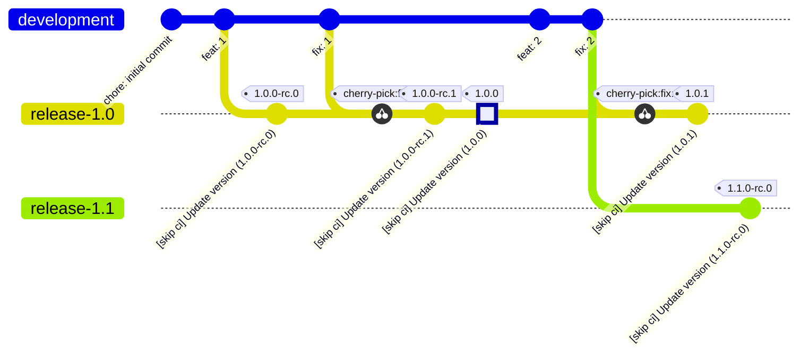

| Output                         | Expected value                                     |
| ------------------------------ | -------------------------------------------------- |
| Next version                   | `1.1.0-rc.0`                                       |
| Git tag                        | `1.1.0-rc.0`                                       |
| Container tags                 | `IMAGE:1.1.0-rc.0` created                         |
| npm artifacts (`tag: version`) | `1.1-rc: 1.1.0-rc.0` created                       |
| GitHub Release                 | `1.1.0-rc.0` - `isPrerelease=true`, `latest=false` |
| Release changelog              | Commits since `1.0.1` only                         |

**Verify:**

```bash
git tag --sort=-version:refname
# --> 1.1.0-rc.0   1.0.1   1.0.0   1.0.0-rc.1   1.0.0-rc.0

docker manifest inspect $IMAGE:1.1.0-rc.0
# --> succeeds (manifest exists)

docker manifest inspect $IMAGE:latest
# --> digest EQUALS digest of $IMAGE:1.0.1 (unchanged)

npm dist-tag ls $PKG
# --> 1.0-rc: 1.0.0-rc.1
#     1.1-rc: 1.1.0-rc.0
#     development: 1.1.0-dev.3
#     latest: 1.0.1

gh release view 1.1.0-rc.0 --json isPrerelease
# --> {"isPrerelease":true}

gh release view 1.1.0-rc.0 --json body | jq -r '.body'
# --> feat: 2
#     (fix: 2 is deduplicated - same commit message already present in 1.0.1)
```

### Scenario 9 - Promote `release-1.1` to stable

**Pre-conditions:** End state of Scenario 8. Tags: `1.1.0-rc.0`, `1.0.1`, `1.0.0`, `1.0.0-rc.1`, `1.0.0-rc.0`.
npm: `latest: 1.0.1`, `1.0-rc: 1.0.0-rc.1`, `1.1-rc: 1.1.0-rc.0`, `development: 1.1.0-dev.3`.
`IMAGE:latest` points to `IMAGE:1.0.1`.

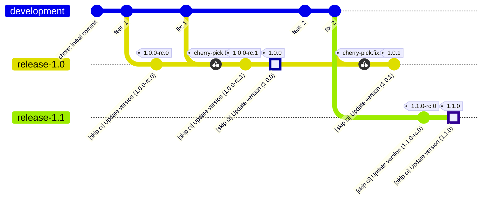

| Output                          | Expected value                                                                                        |
| ------------------------------- | ----------------------------------------------------------------------------------------------------- |
| Next version                    | `1.1.0`                                                                                               |
| Git tag                         | `1.1.0`                                                                                               |
| Container tags                  | `IMAGE:1.1.0` **AND** `IMAGE:latest`                                                                  |
| npm artifacts (tag --> version) | `latest: 1.1.0`                                                                                       |
| GitHub Release                  | `1.1.0` - `isPrerelease=false`, `latest`                                                              |
| Release changelog               | Commits since `1.0.1` (latest global stable). Content: `feat: 2` (`fix: 2` deduplicated with `1.0.1`) |

**Verify:**

```bash
git tag --sort=-version:refname
# --> 1.1.0-rc.0
#     1.1.0
#     1.0.1
#     1.0.0-rc.1
#     1.0.0-rc.0
#     1.0.0

docker manifest inspect $IMAGE:1.1.0
# --> succeeds (manifest exists)

docker manifest inspect $IMAGE:latest
# --> digest EQUALS digest of $IMAGE:1.1.0

npm dist-tag ls $PKG
# --> 1.0-rc: 1.0.0-rc.1
#     1.1-rc: 1.1.0-rc.0
#     development: 1.1.0-dev.3
#     latest: 1.1.0

gh release view 1.1.0 --json isPrerelease
# --> {"isPrerelease":false}

gh release view 1.1.0 --json body | jq -r '.body'
# --> feat: 2
```

### Scenario 10 - Push to `development` after stable `1.1.0` exists

**Pre-conditions:** End state of Scenario 9. Tags: `1.1.0`, `1.1.0-rc.0`, `1.0.1`, `1.0.0`, `1.0.0-rc.1`, `1.0.0-rc.0`.
npm: `latest: 1.1.0`, `1.0-rc: 1.0.0-rc.1`, `1.1-rc: 1.1.0-rc.0`, `development: 1.1.0-dev.3`.
`IMAGE:latest` points to `IMAGE:1.1.0`.

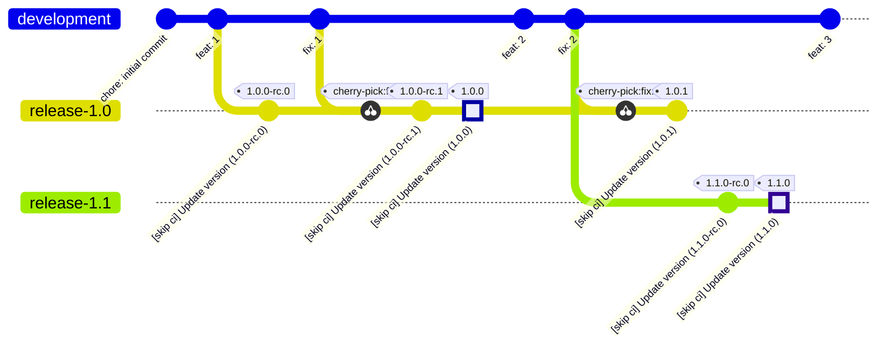

| Output                          | Expected value             |
| ------------------------------- | -------------------------- |
| Next version                    | `1.2.0-dev.1`              |
| Git tag                         | -                          |
| Container tags                  | `IMAGE:development`        |
| npm artifacts (tag --> version) | `development: 1.2.0-dev.1` |
| GitHub Release                  | -                          |
| Release changelog               | -                          |

**Verify:**

```bash
git tag --sort=-version:refname
# --> 1.1.0
#     1.1.0-rc.0
#     1.0.1
#     1.0.0
#     1.0.0-rc.1

docker manifest inspect $IMAGE:development
# --> succeeds (manifest exists and digest is updated)

npm dist-tag ls $PKG
# --> 1.0-rc: 1.0.0-rc.1
#     1.1-rc: 1.1.0-rc.0
#     development: 1.2.0-dev.1
#     latest: 1.1.0

gh release list
# --> 1.1.0       Latest       (1.1.0)
#     1.1.0-rc.0  Pre-release  (1.1.0-rc.0)
#     1.0.1       (1.0.1)
#     1.0.0       (1.0.0)
#     ...
```

### Scenario 11 - Cutting `release-1.2`

**Pre-conditions:** End state of Scenario 10. Tags: `1.1.0`, `1.1.0-rc.0`, `1.0.1`, `1.0.0`, `1.0.0-rc.1`, `1.0.0-rc.0`.
npm: `latest: 1.1.0`, `1.0-rc: 1.0.0-rc.1`, `1.1-rc: 1.1.0-rc.0`, `development: 1.2.0-dev.1`.
`IMAGE:latest` points to `IMAGE:1.1.0`.
`release-1.2` is branched from `development` (which already contains `feat: 3`).

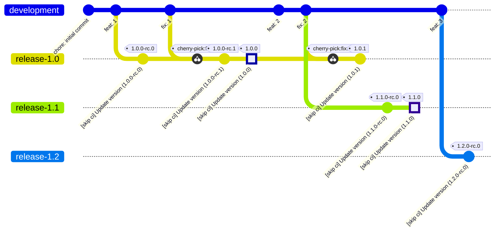

| Output                          | Expected value                                                   |
| ------------------------------- | ---------------------------------------------------------------- |
| Next version                    | `1.2.0-rc.0`                                                     |
| Git tag                         | `1.2.0-rc.0`                                                     |
| Container tags                  | `IMAGE:1.2.0-rc.0` created                                       |
| npm artifacts (tag --> version) | `1.2-rc: 1.2.0-rc.0` created                                     |
| GitHub Release                  | `1.2.0-rc.0` - `isPrerelease=true`, `latest=false`               |
| Release changelog               | Commits since `1.1.0` (latest global stable). Content: `feat: 3` |

**Verify:**

```bash
git tag --sort=-version:refname
# --> 1.2.0-rc.0
#     1.1.0
#     1.1.0-rc.0
#     1.0.1
#     1.0.0
#     1.0.0-rc.1
#     1.0.0-rc.0

docker manifest inspect $IMAGE:1.2.0-rc.0
# --> succeeds (manifest exists)

docker manifest inspect $IMAGE:latest
# --> digest EQUALS digest of $IMAGE:1.1.0 (unchanged)

npm dist-tag ls $PKG
# --> 1.0-rc: 1.0.0-rc.1
#     1.1-rc: 1.1.0-rc.0
#     1.2-rc: 1.2.0-rc.0
#     development: 1.2.0-dev.1
#     latest: 1.1.0

gh release view 1.2.0-rc.0 --json isPrerelease
# --> {"isPrerelease":true}

gh release view 1.2.0-rc.0 --json body | jq -r '.body'
# --> feat: 3
```

### Scenario 12 - Promote `release-1.2` to stable

**Pre-conditions:** End state of Scenario 11. Tags: `1.2.0-rc.0`, `1.1.0`, `1.1.0-rc.0`, `1.0.1`, `1.0.0`, `1.0.0-rc.1`, `1.0.0-rc.0`.
npm: `latest: 1.1.0`, `1.0-rc: 1.0.0-rc.1`, `1.1-rc: 1.1.0-rc.0`, `1.2-rc: 1.2.0-rc.0`, `development: 1.2.0-dev.1`.
`IMAGE:latest` points to `IMAGE:1.1.0`.

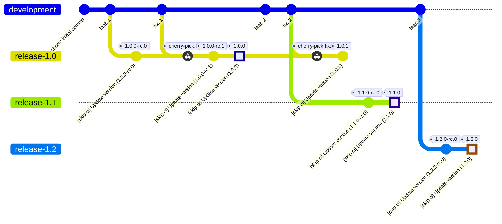

| Output                          | Expected value                                                   |
| ------------------------------- | ---------------------------------------------------------------- |
| Next version                    | `1.2.0`                                                          |
| Git tag                         | `1.2.0`                                                          |
| Container tags                  | `IMAGE:1.2.0` **AND** `IMAGE:latest`                             |
| npm artifacts (tag --> version) | `latest: 1.2.0`                                                  |
| GitHub Release                  | `1.2.0` - `isPrerelease=false`, `latest`                         |
| Release changelog               | Commits since `1.1.0` (latest global stable). Content: `feat: 3` |

**Verify:**

```bash
git tag --sort=-version:refname
# --> 1.2.0-rc.0
#     1.2.0
#     1.1.0-rc.0
#     1.1.0
#     1.0.1
#     1.0.0-rc.1
#     1.0.0-rc.0
#     1.0.0

docker manifest inspect $IMAGE:1.2.0
# --> succeeds (manifest exists)

docker manifest inspect $IMAGE:latest
# --> digest EQUALS digest of $IMAGE:1.2.0

npm dist-tag ls $PKG
# --> 1.0-rc: 1.0.0-rc.1
#     1.1-rc: 1.1.0-rc.0
#     1.2-rc: 1.2.0-rc.0
#     development: 1.2.0-dev.1
#     latest: 1.2.0

gh release view 1.2.0 --json isPrerelease
# --> {"isPrerelease":false}

gh release view 1.2.0 --json body | jq -r '.body'
# --> feat: 3
```

### Scenario 13 - Push more commits to `development` as regular repo lifecycle continues

**Pre-conditions:** End state of Scenario 12. Tags: `1.2.0`, `1.2.0-rc.0`, `1.1.0`, `1.1.0-rc.0`, `1.0.1`, `1.0.0`, `1.0.0-rc.1`, `1.0.0-rc.0`.
npm: `latest: 1.2.0`, `1.0-rc: 1.0.0-rc.1`, `1.1-rc: 1.1.0-rc.0`, `1.2-rc: 1.2.0-rc.0`, `development: 1.2.0-dev.1`.
`IMAGE:latest` points to `IMAGE:1.2.0`.

> [!note]
> If there's no time gap between the commits, next workflow run will cancel the previous one. This may result in missing `1.3.0-dev.1`, `1.3.0-dev.2` tags.
> It not affect the final state of the scenario, though

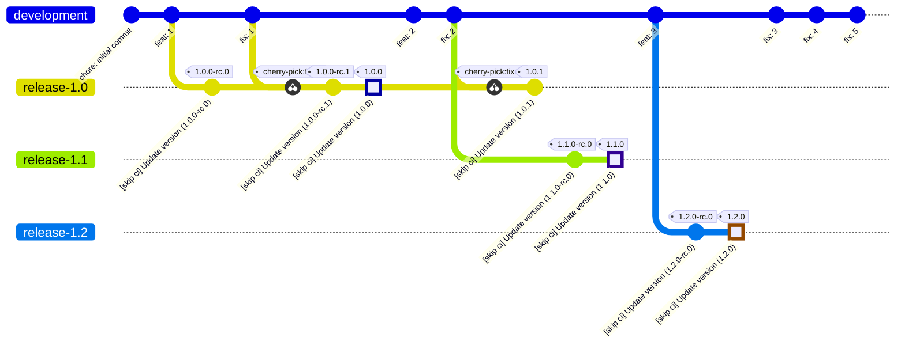

| Output                          | Expected value             |
| ------------------------------- | -------------------------- |
| Next version                    | `1.3.0-dev.3`              |
| Git tag                         | -                          |
| Container tags                  | `IMAGE:development`        |
| npm artifacts (tag --> version) | `development: 1.3.0-dev.3` |
| GitHub Release                  | -                          |
| Release changelog               | -                          |

**Verify:**

```bash
git tag --sort=-version:refname
# --> 1.2.0-rc.0
#     1.2.0
#     1.1.0-rc.0
#     1.1.0
#     1.0.1
#     1.0.0-rc.1
#     1.0.0-rc.0
#     1.0.0
#     (no new tags)

docker manifest inspect $IMAGE:development
# --> succeeds (manifest exists and digest is updated)

npm dist-tag ls $PKG
# --> 1.0-rc: 1.0.0-rc.1
#     1.1-rc: 1.1.0-rc.0
#     1.2-rc: 1.2.0-rc.0
#     development: 1.3.0-dev.3
#     latest: 1.2.0

gh release list
# --> 1.2.0       Latest       (1.2.0)
#     1.2.0-rc.0  Pre-release  (1.2.0-rc.0)
#     1.1.0       (1.1.0)
#     ...
```

### Scenario 14 - Backport fix to `release-1.1` (patch on middle release line)

**Pre-conditions:** End state of Scenario 13. Tags: `1.2.0`, `1.2.0-rc.0`, `1.1.0`, `1.1.0-rc.0`, `1.0.1`, `1.0.0`, `1.0.0-rc.1`, `1.0.0-rc.0`.
npm: `latest: 1.2.0`, `1.0-rc: 1.0.0-rc.1`, `1.1-rc: 1.1.0-rc.0`, `1.2-rc: 1.2.0-rc.0`, `development: 1.3.0-dev.3`.
`IMAGE:latest` points to `IMAGE:1.2.0`.

> [!important]
> A scenario where a **stable patch** does **NOT** receive `:latest`

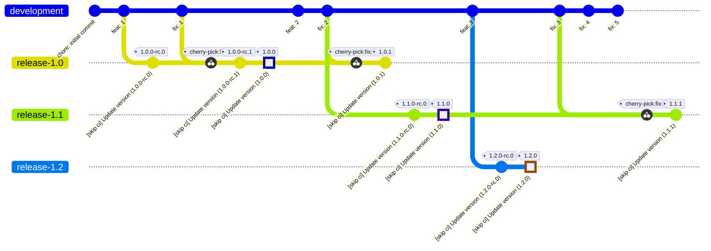

| Output                          | Expected value                                                      |
| ------------------------------- | ------------------------------------------------------------------- |
| Next version                    | `1.1.1`                                                             |
| Git tag                         | `1.1.1`                                                             |
| Container tags                  | `IMAGE:1.1.1` only (**NO** `IMAGE:latest`)                          |
| npm artifacts (tag --> version) | `release-1.1: 1.1.1` (NOT `latest`)                                 |
| GitHub Release                  | `1.1.1` - `isPrerelease=false`, `make_latest=legacy`                |
| Release changelog               | Commits since `1.1.0` (`git describe` on branch). Content: `fix: 3` |

**Verify:**

```bash
git tag --sort=-version:refname
# --> 1.2.0-rc.0
#     1.2.0
#     1.1.1
#     1.1.0-rc.0
#     1.1.0
#     1.0.1
#     1.0.0-rc.1
#     1.0.0-rc.0
#     1.0.0

docker manifest inspect $IMAGE:1.1.1
# --> succeeds (manifest exists)

docker manifest inspect $IMAGE:latest
# --> digest EQUALS digest of $IMAGE:1.2.0 (UNCHANGED - not 1.1.1)

npm dist-tag ls $PKG
# --> 1.0-rc: 1.0.0-rc.1
#     1.1-rc: 1.1.0-rc.0
#     1.2-rc: 1.2.0-rc.0
#     development: 1.3.0-dev.3
#     latest: 1.2.0
#     release-1.1: 1.1.1

gh release view 1.1.1 --json isPrerelease
# --> {"isPrerelease":false}

gh release view 1.1.1 --json body | jq -r '.body'
# --> fix: 3
```

### Scenario 15 - Backport fix to `release-1.2` (patch on highest release line)

**Pre-conditions:** End state of Scenario 14. Tags: `1.2.0`, `1.2.0-rc.0`, `1.1.1`, `1.1.0`, `1.1.0-rc.0`, `1.0.1`, `1.0.0`, `1.0.0-rc.1`, `1.0.0-rc.0`.
npm: `latest: 1.2.0`, `release-1.1: 1.1.1`, others unchanged.
`IMAGE:latest` points to `IMAGE:1.2.0`.

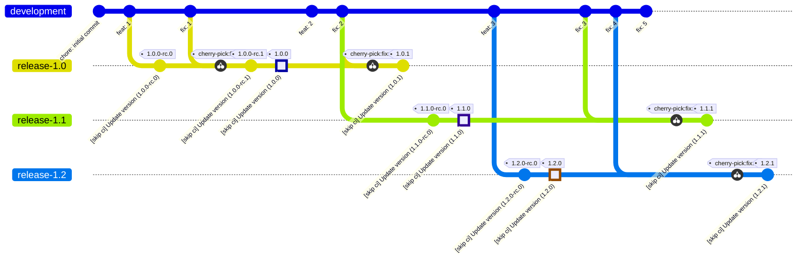

| Output                          | Expected value                                                      |
| ------------------------------- | ------------------------------------------------------------------- |
| Next version                    | `1.2.1`                                                             |
| Git tag                         | `1.2.1`                                                             |
| Container tags                  | `IMAGE:1.2.1` **AND** `IMAGE:latest`                                |
| npm artifacts (tag --> version) | `latest: 1.2.1`                                                     |
| GitHub Release                  | `1.2.1` - `isPrerelease=false`, `make_latest=legacy`                |
| Release changelog               | Commits since `1.2.0` (`git describe` on branch). Content: `fix: 4` |

**Verify:**

```bash
git tag --sort=-version:refname
# --> 1.2.1
#     1.2.0-rc.0
#     1.2.0
#     1.1.1
#     1.1.0-rc.0
#     1.1.0
#     1.0.1
#     1.0.0-rc.1
#     1.0.0-rc.0
#     1.0.0

docker manifest inspect $IMAGE:1.2.1
# --> succeeds (manifest exists)

docker manifest inspect $IMAGE:latest
# --> digest EQUALS digest of $IMAGE:1.2.1

npm dist-tag ls $PKG
# --> 1.0-rc: 1.0.0-rc.1
#     1.1-rc: 1.1.0-rc.0
#     1.2-rc: 1.2.0-rc.0
#     development: 1.3.0-dev.3
#     latest: 1.2.1
#     release-1.1: 1.1.1

gh release view 1.2.1 --json isPrerelease
# --> {"isPrerelease":false}

gh release view 1.2.1 --json body | jq -r '.body'
# --> fix: 4
```

### Scenario 16 - Backport fix to `release-1.0` (patch on oldest release line)

**Pre-conditions:** End state of Scenario 15. Tags: `1.2.1`, `1.2.0`, `1.2.0-rc.0`, `1.1.1`, `1.1.0`, `1.1.0-rc.0`, `1.0.1`, `1.0.0`, `1.0.0-rc.1`, `1.0.0-rc.0`.
npm: `latest: 1.2.1`, `release-1.1: 1.1.1`, others unchanged.
`IMAGE:latest` points to `IMAGE:1.2.1`.

> [!important]
> A scenario where a stable patch does **NOT** receive `:latest`

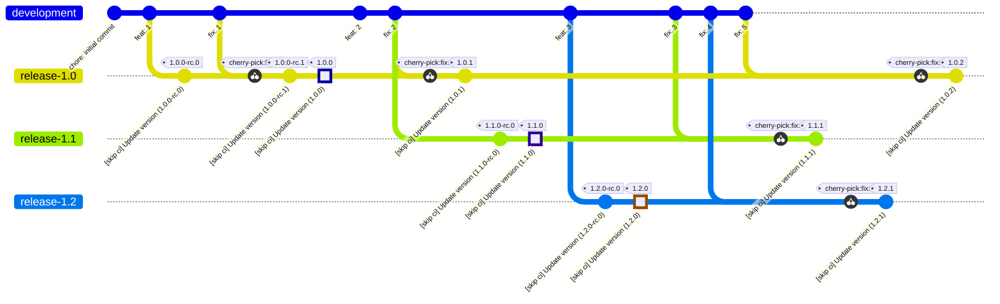

| Output                          | Expected value                                                      |
| ------------------------------- | ------------------------------------------------------------------- |
| Next version                    | `1.0.2`                                                             |
| Git tag                         | `1.0.2`                                                             |
| Container tags                  | `IMAGE:1.0.2` only (**NO** `IMAGE:latest`)                          |
| npm artifacts (tag --> version) | `release-1.0: 1.0.2` (NOT `latest`)                                 |
| GitHub Release                  | `1.0.2` - `isPrerelease=false`, `make_latest=legacy`                |
| Release changelog               | Commits since `1.0.1` (`git describe` on branch). Content: `fix: 5` |

**Verify:**

```bash
git tag --sort=-version:refname
# --> 1.2.1
#     1.2.0-rc.0
#     1.2.0
#     1.1.1
#     1.1.0-rc.0
#     1.1.0
#     1.0.2
#     1.0.1
#     1.0.0-rc.1
#     1.0.0-rc.0
#     1.0.0

docker manifest inspect $IMAGE:1.0.2
# --> succeeds (manifest exists)

docker manifest inspect $IMAGE:latest
# --> digest EQUALS digest of $IMAGE:1.2.1 (UNCHANGED - not 1.0.2)

npm dist-tag ls $PKG
# --> 1.0-rc: 1.0.0-rc.1
#     1.1-rc: 1.1.0-rc.0
#     1.2-rc: 1.2.0-rc.0
#     development: 1.3.0-dev.3
#     latest: 1.2.1
#     release-1.0: 1.0.2
#     release-1.1: 1.1.1

gh release view 1.0.2 --json isPrerelease
# --> {"isPrerelease":false}

gh release view 1.0.2 --json body | jq -r '.body'
# --> fix: 5
```
